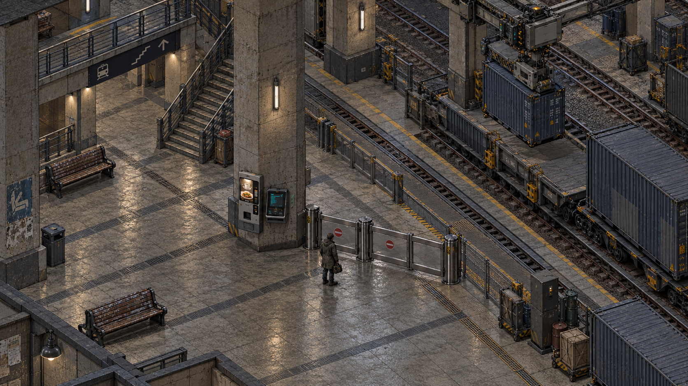
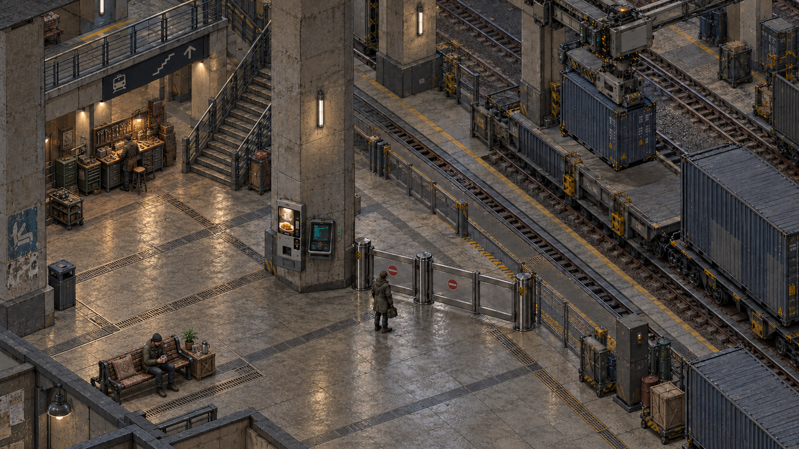
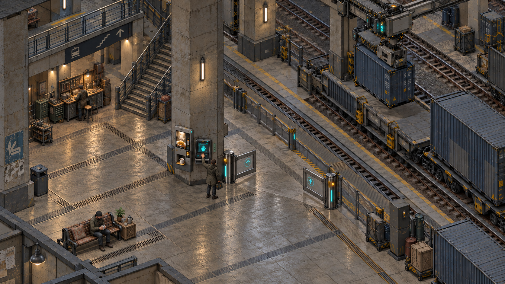

# Overhead Station Studies — Current Presentation Tests

## Purpose

Apply the user's Fallout 1/2-like [oblique/trimetric presentation direction](../../world/canon/camera-and-readability.md) to the three station conditions. The [earlier eye-level studies](station-visual-tests.md) supply material and occupancy reference only.

## Fixed View and Layout

A continuous municipal railway level slice viewed from a fixed elevated three-quarter near-parallel camera. Show a passenger concourse, freight rails and trolley, overhead handling equipment, repeated piers, service access, a gate, terminal, dispenser, and bench. Cut away roofs and near walls for visibility. Character and prop scale remain consistent with distance.

Use tactile prerendered-sprite-like CRPG forms, clear directional shadows, restrained surface texture, and readable silhouettes. Avoid horizons, perspective convergence, photography, lens blur, toy diorama framing, and a floating isolated island.

## Variants

- **A:** serviced freight machinery beside neglected passenger space; closed gate and unanswered human.
- **B:** the same layout with skilled repairs, a compact workshop, tea, plants, and ordinary human occupation.
- **C:** edit B; a quiet LCL gesture prompts oriented machinery, opened access, provision, and restrained coordinated indicators.

## Method

Built-in image generation, one call per image. Use the earlier A as an architectural/material reference for the new overhead A; then preserve overhead A's camera and layout through edits B and C. Save every final asset and exact prompt in `images/moodboard/station-overhead-tests/`.

## Review

Check projection and consistent scale first; then routes, interaction points, actor silhouettes, occlusion, maintenance boundaries, ordinary care, and LCL consequences. Inspect a reduced preview as well as full size. Concept art approximates projection and does not establish engine geometry.

## Results

Generated and visually reviewed using the built-in image generation tool. The [exact prompts and input relationships](../../../images/moodboard/station-overhead-tests/prompts.json) are saved with the images.

### A — Automated Maintenance

Elevated framing reveals tiled routes, service stairs, separated freight operation, the barrier, and terminal together. The camera is much closer to the intended classic CRPG play view. Ground continues beyond the frame; no miniature pedestal or photographic horizon appears. Clean machine components coexist with worn benches and passenger space.

### B — Human Occupation

The same piers, stairs, rails, crane, gate, and terminal are retained. An organized workshop forms a readable group under the gallery; a repaired bench, cushion, tea table, and plant identify a domestic corner. The concourse stays open and the gate stays closed. Maintenance reads through grouped forms and floor interventions as well as tiny surface details.

### C — LCL Recognition

The original adult moves to the relay. The gate opens into a visible passage, the dispenser offers a cup, and existing machine indicators coordinate. Human occupation remains intact. Access changes communicate the main response without a large aura. The relay gesture can still read as ordinary touch input; distinguish LCL's reciprocal response in a later motion and sound study.

### Review

| Criterion | Assessment | Further work |
| --- | --- | --- |
| Camera and scale | Fixed elevated view, flattened depth, closely matched layout across images | Generated art approximates an oblique/trimetric camera; it does not verify exact Fallout angles or projection mathematics |
| Play-space hierarchy | Gate, routes, terminal, actor, freight corridor, and occupied areas are recognizable | Test a wider zoom and stronger value separation between actors and ground |
| Human care | Workshop and rest area stay readable as grouped silhouettes | Small embroidery and photographs are supporting detail, not reliable interaction cues |
| Occlusion | Roof is omitted and the principal concourse stays visible | Tall piers and upper structures still need an engine-specific visibility policy |
| LCL | Opened access and coordinated hardware remain readable | A still cannot verify pulse synchronization, waiting, or an answering sound |
| Surface treatment | Tactile sprite-like construction and restrained material palette | More detailed and smoother than the original Fallout 1/2 assets; test coarser clustered textures independently of camera |

**Current conclusion:** the overhead treatment expresses the accepted aesthetic from a much more appropriate play-camera viewpoint. The station's maintenance and human occupation remain legible after the camera change. Keep this camera family for future ideation; calibrate texture density, actor contrast, and zoom next rather than returning to cinematic framing.

These remain exploratory images, not playable levels, production sprites, exact projection proofs, or final character designs.
